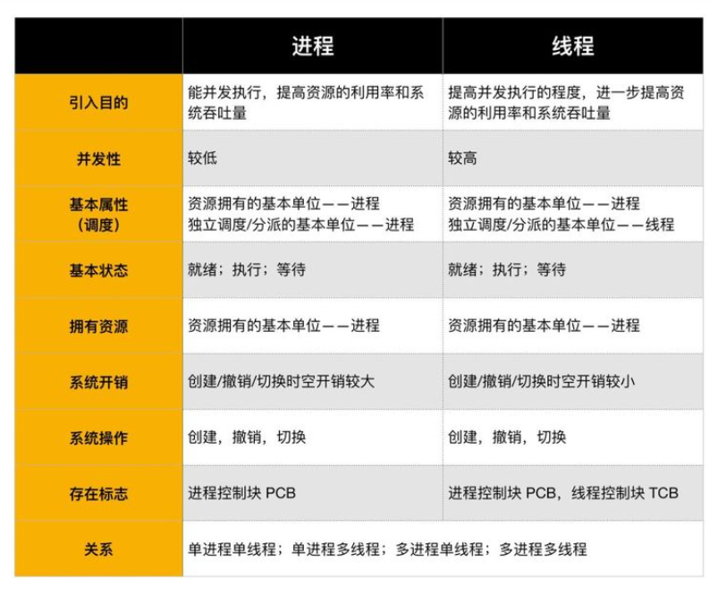

物理层

数据链路层

网络层

传输层

会话层

表示层

应用层

# 2022/02/25

## 通联金融

1. 说一下ArrayList和LinkedList

2. 讲一下Spring

3. 说一下七层网络模型

4. 你知道常用加密手段，对称加密和非对称加密的区别吗？

5. 数据库事务的隔离级别？

6. 事务的四大特性？

7. Spring MVC的执行流程

8. 你了解的设计模式

   （想要的回答：单例、工厂、责任链、代理、`策略`(!!!!)、观察者、装饰器、模板）

9. 讲一下JDK动态代理的具体写法

10. 讲一下你的项目

11. 听说你用git部署前端项目，讲一下具体部署过程

12. 说说你常用的linux命令

# 2022/03/07

## 成都音泰思

1. 解释一下多线程、集合、反射？
2. 说一下你的项目在哪里用到了？
3. 讲一下项目的详情？
4. 说一下python爬虫是如何爬取的？

# 2022/03/08

长城开发

1. 反射有什么作用?

2. 反射是如何进行反射的，可以进行哪些操作？

3. 代理设计模式？

4. 常见的设计模式?

5. 如何自定义注解？注解底层如何实现的？

   每个注解类型的直接父接口都是`java.lang.annotation.Annotation`，

   - 注解是一个接口，它继承自java.lang.annotation.Annotation父接口。
   - `@Counter`对应的接口接口除了继承了java.lang.annotation.Annotation中的抽象方法，自身定义了一个抽象方法`public abstract int count();`

   既然注解最后转化为一个接口，注解中定义的注解成员属性会转化为抽象方法，那么最后这些注解成员属性怎么进行赋值的呢?

   答案就是：为注解对应的接口生成一个实现该接口的动态代理类。直接点说就是：Java通过动态代理的方式生成了一个实现了"注解对应接口"的实例，该代理类实例实现了"注解成员属性对应的方法"，这个步骤类似于"注解成员属性"的赋值过程，这样子就可以在程序运行的时候通过反射获取到注解的成员属性(这里注解必须是运行时可见的，也就是使用了@Retention(RetentionPolicy.RUNTIME)，另外需要理解JDK原生动态代理和反射相关内容)。

   

6. 讲一下常用的集合？哪些集合是线程安全的？

7. 线程使用的四大方式？分别有什么特点？

8. MySQL聚合函数有哪些？

   avg、count、sum、max、min

9. MySQL隔离界别和造成的问题?

9. Redis的五大数据结构

11. Redis的过期键的清除策略

    + noeviction：当内存不足以容纳新写入数据时，新写入操作会报错，这个一般没人用
    + allkeys-lru：当内存不足以容纳新写入数据时，在键空间中，移除最近最少使用的key（这个是最常用的）
    + allkeys-random：当内存不足以容纳新写入数据时，在键空间中，随机移除某个key，这个一般没人用吧
    + volatile-lru：当内存不足以容纳新写入数据时，在设置了过期时间的键空间中，移除最近最少使用的key（这个一般不太合适）
    + volatile-random：当内存不足以容纳新写入数据时，在设置了过期时间的键空间中，随机移除某个key
    + volatile-ttl：当内存不足以容纳新写入数据时，在设置了过期时间的键空间中，有更早过期时间的key优先移除

10. having的作用？

11. 计算机网络七层模型?

12. 操作系统线程和进程的区别和联系？

